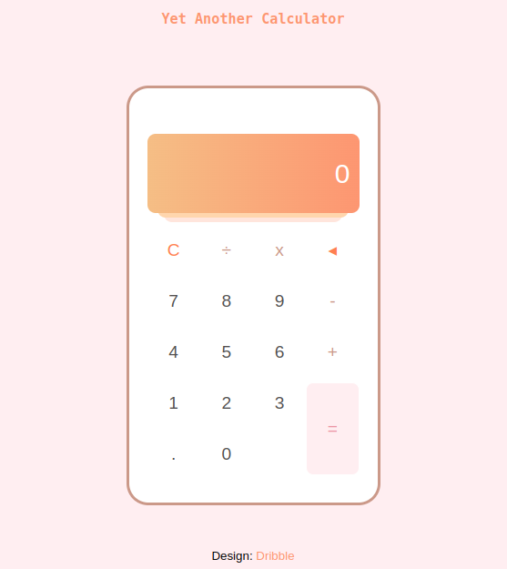
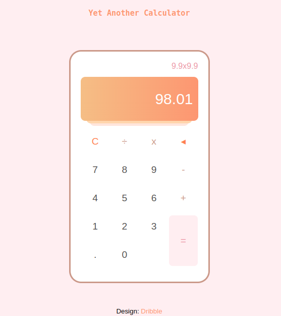

# Odin-calculator

This is my attempt at Project: [Calculator](https://www.theodinproject.com/lessons/foundations-calculator), the final of [The Odin Project's](https://www.theodinproject.com/) Foundation projects. It is a simple calculator written in JavaScript and CSS.

## Skills demonstrated in this project

*  JavaScript.
*  DOM manipulation and Events.
*  CSS Grid and Flex.
* [Live preview](https://nonines.github.io/Odin-calculator/)

## Screenshots

